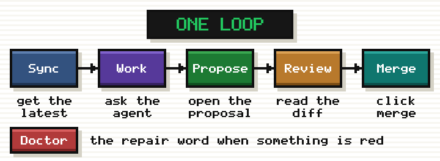
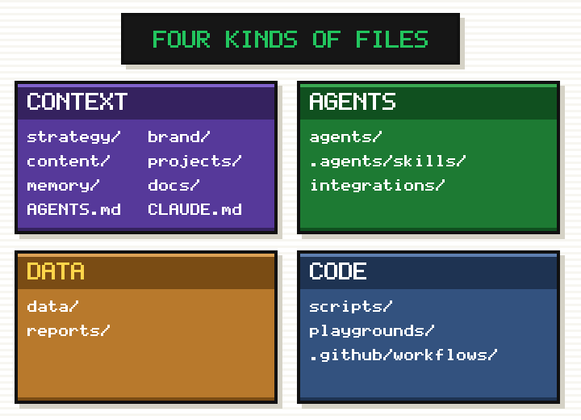

  

<h1 align="center">Marketing as Code</h1>

  <b>The starter repo for a marketing team that runs on code. 
  Plain text your AI agents can read and write.</b>

  
  
  

  <a href="#quick-start">Quick start</a> ·
  <a href="#what-this-is-and-what-it-is-not">What this is</a> ·
  <a href="docs/is-this-for-you.md">Is this for you?</a> ·
  <a href="docs/week-one.md">Week one</a> ·
  <a href="#which-coding-agent">Which agent?</a> ·
  <a href="docs/make-it-yours.md">Make it yours</a> ·
  <a href="docs/new-to-github.md">New to GitHub?</a>

---

Ask a marketing team where their marketing lives and you get a list. Campaign
plans in a project tool. Briefs in a shared drive. Website copy behind a CMS
login. Dashboards nobody opens. Slack, where answers go to die. Seven logins,
and one marketer in the middle acting as the human API between them. AI
can't help either, because the context it needs is scattered behind those
logins.

The fix is not moving marketing to GitHub. A repository is storage with
version history and no intelligence inside. The fix is moving the work to
code: strategy, messaging, briefs, decisions and knowledge as plain text, in
one place, where agents read all of it and write into it. The repo is the
floor. The agents are the point.

This repository is that floor, pre-built. A roster of agents and skills
for every marketing function ([agents/README.md](agents/README.md)). Five
tools wired across six integration categories, and a catalog of the rest,
one command each. No server. Start from it, make it yours, and run your
marketing from here.

## What this is, and what it is not

This is a Git repository with a folder structure, templates, a set of agent
and skill definitions, five wired tools and a review workflow, for a B2B
marketing team that works with a coding agent. You copy it, answer the
setup interview, and your marketing lives here as plain text that agents
read and write and a person approves.

It is not:

- **A product or a service.** Nothing to sign up for, no server, no account
  with anyone. Your copy is yours, on your GitHub.
- **A CMS or a website.** Published content lives here as text. The site
  that renders it is a separate repo
  ([docs/architecture.md](docs/architecture.md#the-website-a-standalone-sibling-repo-deliberately-not-in-here)).
- **Marketing automation.** Agents draft, analyze and propose. A person
  publishes, sends and merges. Nothing goes out on its own.
- **A data warehouse.** `data/` holds dated snapshots, not your event stream.
- **A replacement for your task tool, CRM or analytics.** It talks to them
  ([integrations/README.md](integrations/README.md)).

## What you need

- A GitHub account and your own private copy of this repo. GitHub Free works
  for a careful team of two; a private repo whose rules are enforced rather
  than suggested needs GitHub Team or Pro
  ([docs/github-settings.md](docs/github-settings.md)).
- A coding agent per person. [Claude Code](https://claude.com/claude-code)
  is what this repo is tuned for; Cursor and Codex read the same files
  ([the table below](#which-coding-agent)).
- On each computer: [GitHub Desktop](https://desktop.github.com), Python 3.9
  or newer, and the [GitHub CLI](https://cli.github.com) for one login
  command, once. Node.js only if you turn on the DataForSEO server. The
  scripts are written and tested on macOS and Linux; on Windows they run
  in WSL or Git Bash, untested by the maintainers
  ([docs/troubleshooting.md](docs/troubleshooting.md)).
- One person who will read a diff and click Merge. This is the real
  requirement.
- Keys only for the integrations you turn on. The setup interview, content,
  review, projects, the decision log, transcripts and the quarterly review
  work with none.

## What it costs

The repo is free (MIT). What you pay for around it, for a team of about
five:

- **GitHub.** Free on a public repo. A private repo with enforced rules is a
  per-seat plan, the smallest line item.
- **Coding-agent seats.** One per active person. The largest line item.
- **Data, pay as you go.** DataForSEO bills per request, Apify per run. Small
  at this size, and only on the days you run those skills.
- **Optional.** An API key for the unattended agent in GitHub Actions,
  billed per run.

Expect the agent seats to dominate and everything else to be a rounding
error.

## See it filled

[examples/beacon/](examples/beacon/) is a fictional company with the
templates filled: a positioning, messaging, an ideal customer profile, one
persona, one battlecard, a voice guide, the metric definitions, five
keywords with a snapshot, a project with its status, a published post,
three logged decisions, and a quarterly review with its dashboard. Start
with [the positioning](examples/beacon/strategy/positioning.md),
[the post](examples/beacon/content/2026-08-what-customers-want-during-an-outage/draft.md)
and [the review](examples/beacon/reports/qmr/2026-q2/report.md); download
the dashboard beside the review and open it in a browser. Every path
mirrors the real one. Delete the folder when you adopt the repo; the doctor
reminds you.

## What you get

- **The hierarchy.** A folder structure for a marketing team's second brain:
  strategy, brand, content, projects, data, reports, memory, agents,
  playgrounds. Every folder explains itself and ships templates instead of
  blank pages. The reasoning is in [docs/architecture.md](docs/architecture.md).
- **A default agent set.** Agents and skills for onboarding, content,
  project scaffolding, review, meeting transcripts, the quarterly marketing
  review, keyword and ranking analysis, AI answer-engine tracking, account
  research and campaign discovery. Each is a plain text file you can read
  and edit, in a format Claude Code, Cursor and Codex all understand.
- **A memory that compounds.** A meeting transcript lands, an agent processes
  it, updates the knowledge base, logs the decisions and files the follow-ups
  in your task tool. Meetings stop evaporating.
- **A prototyping culture.** Come to meetings with a landing page mock or an
  email sequence preview built from one sentence. Not a deck about it.
  `playgrounds/` holds prototypes until the decision is logged, then they go.
- **Best practices.** Which tools you replace, which you demote to data rails
  your agents operate through an API, and which you merely index. Plus the
  review workflow that keeps a human in charge of everything that ships.

## Is this for your team?

Not necessarily. Marketing as code is a change project before it is a tool
project. Team size, the appetite for semi-technical work (a repository, pull
requests, API keys, a coding agent) and a leader who will read a diff decide
whether it fits. [docs/is-this-for-you.md](docs/is-this-for-you.md) is the
fit check, with profiles for one or two people, teams of about 5, 20 and
100, and agencies.
[docs/stages.md](docs/stages.md) is the path for everyone not there yet: use
the AI tools you already pay for, then hand one activity to one agent, then
this repo.

## Never used GitHub?

You are who this repo was built for. You don't need to be a developer or
live in a terminal. [docs/new-to-github.md](docs/new-to-github.md) explains
what a repository is in plain language and walks the path with one command,
once: the GitHub website, GitHub Desktop, and a coding agent that does the
technical parts for you.

## Quick start

1. **Get your own copy.** On this page, click "Use this template", then
   "Create a new repository", and make it private. Do not fork: a fork of a
   public repository cannot be made private. Clone your copy with
   [GitHub Desktop](https://desktop.github.com).
2. **Open it with a coding agent.** [Claude Code](https://claude.com/claude-code)
   is what this repo is tuned for ([CLAUDE.md](CLAUDE.md)), in the terminal
   or the desktop app; Cursor and Codex read the same files
   ([which agent?](#which-coding-agent)). When it asks about three project
   MCP servers, say No to all three for now.
3. **Say `/doctor`.** It names the one thing to set up on this computer, a
   GitHub login, once, and tells you when you are ready.
4. **Say `/setup`.** The interview fills the strategy, voice and metric
   templates from your answers and connects only the tools you use. Rounds
   1 to 5 and round 10 are enough for day one.
5. **Do one real piece of work.** `/new-content` drafts a piece in your
   voice, `/review` checks it against your strategy, `/propose` opens the
   proposal, and you read the diff and click Merge. Or drop a transcript in
   `memory/transcripts/inbox/` and say `/chief-of-staff`.
6. **Next morning, say `/sync`.** It brings in what was approved and says
   what is waiting on you. Then the first integration: tell the agent "We
   use Zoom for meetings. Automate reading the transcripts into the inbox."
   and `/add-integration` builds it by
   [the guide](integrations/adding-an-integration.md).

The full first week, in order, one command per step:
[docs/week-one.md](docs/week-one.md). That loop is the whole ritual
([docs/workflow.md](docs/workflow.md)):

  

## Which coding agent

| | Claude Code | Cursor | Codex |
| --- | --- | --- | --- |
| Reads `AGENTS.md` | yes | yes | yes |
| Finds the skills | through `.claude/skills/`, symlinks kept by `scripts/sync_skills.py` | `.agents/skills/` directly | `.agents/skills/` directly |
| Runs one | `/setup`, or ask in plain English | picks by description; ask in plain English | `$setup`, or ask in plain English |
| MCP servers | `.mcp.json` | `.cursor/mcp.json` | TOML pasted from [the guide](integrations/adding-an-integration.md#configuring-an-mcp-server-per-coding-agent) |
| Guardrails for keys | `.claude/settings.json` stops the agent reading `.env` | the skills' own rules only | the skills' own rules only |

Whichever you use, keys are per person and never shared
([docs/secrets.md](docs/secrets.md)). The lifecycle words (`/sync`,
`/propose`, `/doctor`) are slash commands in Claude Code; in Cursor or
Codex, say the word. The table was checked against the three vendors'
documentation on 2026-09-06; the skill format is the Agent Skills open
standard, so a newer version reads the same files.

## A blueprint, not a product

This repo is a starting point. Expect to change it.

What works with no keys and nothing connected: the setup interview, content
briefs and drafts, project folders, the pre-publish review, the decision log,
processing a transcript you drop in the inbox, and a quarterly review built
from exported CSVs. Try that part first.

What you make yours: the **integrations** (your CRM, task tool, meeting
recorder, analytics), the **structure** where it doesn't match your team,
and the **agents**, which are Markdown files you edit. Five tools ship
wired, across six categories, as worked examples. For the rest of your
stack, the catalog in
[integrations/catalog/](integrations/catalog/README.md) holds the routes for
the common vendors in every category (CRM, marketing automation, analytics,
ads, social, CMS, enrichment, and so on), and your coding agent wires one
with `python3 scripts/wire_integration.py <vendor>`; skills name the
category, not the vendor, so nothing else changes. A tool the catalog does
not know it builds by [the guide](integrations/adding-an-integration.md):
the vendor's MCP server first, its CLI second, a small script last.

Nothing here needs a server. Work runs where a person is typing to a coding
agent, or on a schedule in GitHub Actions.
[docs/operating-model.md](docs/operating-model.md) lays out the trade-off.

What to rename, replace and delete when you adopt it, and how to take
later improvements from the template without touching your own files, is
in [docs/make-it-yours.md](docs/make-it-yours.md).

## Four kinds of files

  

- **Context**, what the team knows: `strategy/`, `brand/`, `content/`,
  `projects/`, `memory/`, `docs/`, plus `AGENTS.md` and `CLAUDE.md`. Every
  strategy file is dated, and the health check flags stale ones.
- **Agents**, the workforce as instructions in English: `agents/`,
  `.agents/skills/`, `integrations/`.
- **Code**, small deterministic scripts and throwaway prototypes the agent
  writes: `scripts/`, `playgrounds/`, `.github/workflows/`.
- **Data**, tables, dated snapshots and the reports built from them:
  `data/`, `reports/`.

The full model, and how context can be served live by a marketing context
layer over MCP, is in [AGENTS.md](AGENTS.md) and
[integrations/context-layer.md](integrations/context-layer.md).

## How this repo is organized

| Kind | Folder | What lives there |
| --- | --- | --- |
| Context | `strategy/` | Positioning, messaging, ICP, personas, battlecards |
| Context | `brand/` | Voice, visual identity, logos, design tokens |
| Context | `content/` | Every piece of content, at every stage |
| Context | `projects/` | Briefs and status; campaigns as projects that contain projects |
| Context | `memory/` | The decision log and the knowledge base, fed from transcripts |
| Context | `docs/` | Guides: fit check, stages, workflow, secrets, architecture |
| Agents | `agents/` | The roster; definitions live in `.agents/skills/` |
| Agents | `integrations/` | How the repo talks to your stack, and the rules agents follow |
| Code | `playgrounds/` | Disposable prototypes |
| Code | `scripts/` | Deterministic helpers with no AI inside |
| Data | `data/` | Keyword tables, snapshots, target accounts, the metrics ontology |
| Data | `reports/` | Analyses, the quarterly review, HTML dashboards |

## Project status

The structure, templates, offline workflows and guides are in place. The
integrations are worked examples plus a guide for adding yours. What is
still planned is in [docs/roadmap.md](docs/roadmap.md). Take it, change it,
and send back what others could reuse
([CONTRIBUTING.md](CONTRIBUTING.md)).

## Getting help

Something red or confusing in your copy: say `/doctor` first, then read
[docs/troubleshooting.md](docs/troubleshooting.md), which lists every
message with its fix. Found a bug in the template itself, or a catalog
entry that is out of date: open an issue on this repository. A question
about whether or how to use it: start a discussion. A security concern:
[SECURITY.md](SECURITY.md), never a public issue.

## Who is behind this

Maintained by [Calven](https://calven.ai). It distills how Calven runs its
own marketing from repositories with agents. Calven also makes the
marketing context layer described in
[integrations/context-layer.md](integrations/context-layer.md). The repo
works without it.

## License

[MIT](LICENSE).
